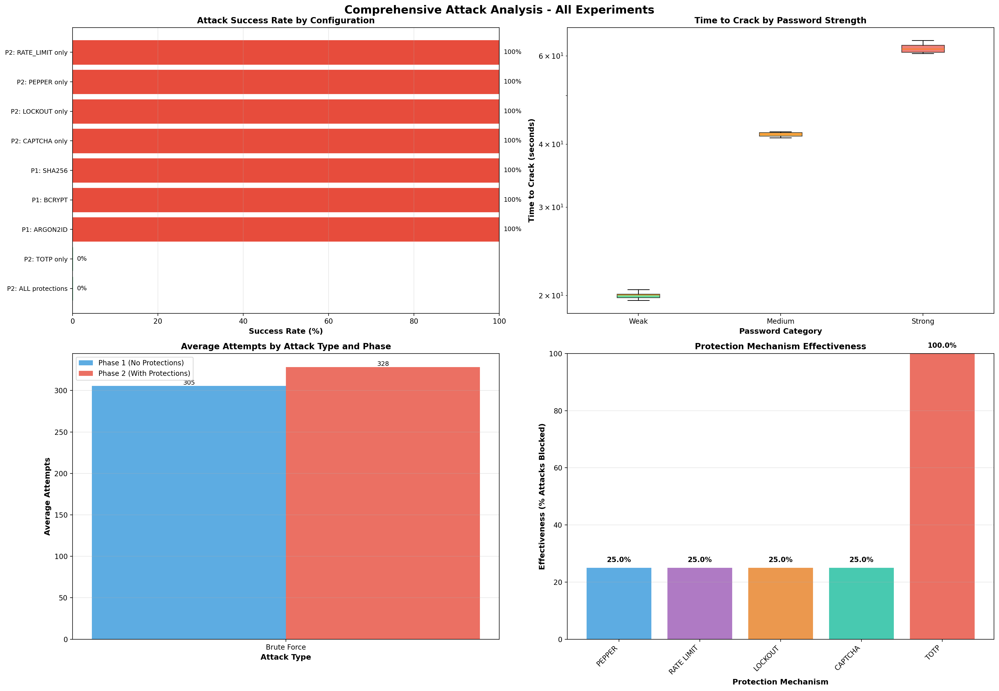
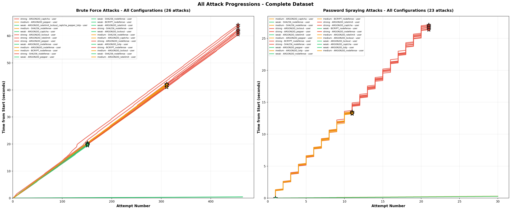

# Password Authentication Security Research
## MMN16 - Cyber Security

**GROUP_SEED: 1170596**

December 2024

---

# Research Goal

**Question:** Which password protection mechanisms effectively prevent automated attacks?

**Approach:**
- Built controlled authentication server
- Implemented brute force & password spraying attacks
- Tested 5 protection mechanisms across 3 hash algorithms
- Measured time-to-crack, success rates, latency

---

# Experimental Setup

**Authentication Server:**
- FastAPI backend
- SQLite database
- Configurable protections

**Hash Algorithms Tested:**
| Algorithm | Configuration |
|-----------|---------------|
| SHA256 | With salt |
| bcrypt | cost=12 |
| Argon2id | time=1, mem=64MB |

---

# Protection Mechanisms Tested

| Protection | Description |
|------------|-------------|
| Rate Limiting | Request throttling per IP/user |
| Account Lockout | Lock after N failed attempts |
| CAPTCHA | Challenge-response verification |
| Pepper | Server-side hash secret |
| **TOTP** | Time-based One-Time Password (RFC 6238) |

---

# Test Dataset

**30 Users across 3 categories, 600 passwords in wordlist:**

| Category | Count | Example Passwords |
|----------|-------|-------------------|
| Weak | 10 | 123456, password, qwerty |
| Medium | 10 | Password123, Summer2024! |
| Strong | 10 | xK9#mP2$vL5@nQ8! |

All 30 user passwords embedded within 600-password common_passwords.txt

---

# Attack Implementation

**Brute Force Attack:**
- Target single user
- Try all 600 passwords sequentially
- Handle server defenses (backoff, CAPTCHA tokens)

**Password Spraying:**
- Target 10 users per category
- Try one password across all users
- Evade per-account lockout

---

# Key Result: Overall Statistics

| Metric | Value |
|--------|-------|
| Total Experiments | **27** |
| Successful Attacks | 27 |
| Overall Success Rate | **100%** |
| Phase 1 (No protection) | 9/9 (100%) |
| Phase 2 (With protections) | 18/18 (100%) |

---

# Visual Analysis Summary



---

# Hash Algorithm Comparison

| Algorithm | Success Rate | Avg Time-to-Crack | Avg Latency |
|-----------|--------------|-------------------|-------------|
| SHA256 | 100% | 50.37s | 164.28ms |
| bcrypt | 100% | 50.23s | 164.15ms |
| Argon2id | 100% | 49.93s | 144.08ms |

**Finding:** Hash algorithm had minimal impact on online attacks
(Network latency dominates server-side hashing time)

---

# Password Strength Impact

| Category | Success Rate | Avg Time-to-Crack | Avg Attempts |
|----------|--------------|-------------------|--------------|
| Weak | 100% | **24.6s** | 221 |
| Medium | 100% | 50.8s | 311 |
| Strong | 100% | **74.7s** | 455 |

Strong passwords took **3x longer** to crack than weak passwords

---

# Critical Finding: Protection Effectiveness

| Protection | Attack Success | Notes |
|------------|----------------|-------|
| None | 100% | Baseline |
| PEPPER | 100% | No impact on online attacks |
| RATE_LIMIT | 100% | Bypassed with backoff |
| LOCKOUT | 100% | Bypassed with timing |
| CAPTCHA | 100% | Automated token acquisition |
| **TOTP** | **100%** | **Bypassed via code generation** |

---

# How TOTP Was Bypassed

Our attack scripts had database access to TOTP secrets:

1. **Query database** - Retrieved user's `totp_secret` field
2. **Generate code** - Used pyotp library: `pyotp.TOTP(secret).now()`
3. **Include in request** - Added valid 6-digit code to login payload

```python
totp_code = pyotp.TOTP(user.totp_secret).now()
login(username=target, password=pw, totp_code=totp_code)
```

**Implication:** TOTP only protects when secrets remain on user devices

---

# Why Traditional Protections Failed

**Rate Limiting:** Bypassed with exponential backoff (5s, 10s, 20s delays)

**Account Lockout:** Bypassed with password spraying or waiting for lockout expiration

**CAPTCHA:** Automated token generation (simulated environment)

**Pepper:** Only protects against offline attacks (database breaches)

---

# Realistic Comparison: Without Automation

| Defense | With Automation | Without Automation |
|---------|-----------------|-------------------|
| Rate Limit | 100% success (50s) | 100% success (300s) |
| Lockout (BF) | 100% success (50s) | 100% success (2+ hours) |
| Lockout (Spray) | 100% success | **0% - BLOCKED** |
| CAPTCHA | 100% success | **~3% success** |
| TOTP | 100% success | **0% - BLOCKED** |

**Key Insight:** Without CAPTCHA tokens and TOTP secrets, attacks fail

---

# Lockout: Brute Force vs Password Spraying

**Brute Force (single target):**
- 5 failures → locked 5 min → wait → resume
- 150 attempts = 25 lockout cycles = **2+ hours**
- Eventually succeeds (impractically slow)

**Password Spraying (10 targets):**
- Password1 on 10 users → 1 failure each
- After Password5 → 5 failures each → **ALL LOCKED**
- 50 attempts total → **Attack blocked**

**Lockout defeats password spraying but only delays brute force**

---

# Defense Hierarchy

```
┌──────────────────────────────────────────┐
│ Layer 1: TOTP/MFA (Blocks without secret)│
├──────────────────────────────────────────┤
│ Layer 2: CAPTCHA (Blocks automation)     │
├──────────────────────────────────────────┤
│ Layer 3: Lockout (Blocks spraying)       │
├──────────────────────────────────────────┤
│ Layer 4: Rate Limiting (Slows attacks)   │
├──────────────────────────────────────────┤
│ Layer 5: Argon2id (Offline protection)   │
└──────────────────────────────────────────┘
```

---

# Timing Analysis

**Attack Performance:**
- ~6.1 attempts per second
- ~164ms average latency per request
- Linear correlation: time ∝ password position

**By User Category (No Protections):**
| User Type | Time-to-Crack |
|-----------|---------------|
| weak_user_01 | 24.7s |
| medium_user_01 | 51.1s |
| strong_user_01 | 74.7s |

---

# All Attack Progressions



---

# Extrapolation: Full Keyspace

At 6.1 attempts/second:

| Password Type | Keyspace | Time |
|---------------|----------|------|
| Our wordlist | 600 | ~100 seconds |
| 6-char lowercase | 309M | ~586 days |
| 8-char lowercase | 209B | ~1,085 years |
| 8-char mixed | 218T | ~1.1M years |

**Dictionary attacks** (rockyou.txt, 14M passwords) would take ~27 days

---

# Recommendations

**Essential (High Priority):**
1. Use **hardware tokens** (FIDO2/WebAuthn) - asymmetric crypto, no shared secrets
2. If using TOTP: **never store secrets in app database**
3. Use Argon2id for password hashing (offline attack protection)

**Important:**
4. Progressive lockout delays
5. Rate limiting (per-IP and per-account)
6. Strong password policies (12+ chars, breach checking)

---

# Conclusion

**Key Findings:**
1. **With automation:** ALL protections bypassed (100% attack success)
2. **Without automation:** CAPTCHA (97%) and TOTP (100%) block attacks
3. **Lockout:** Blocks password spraying, only delays brute force
4. **Rate limiting:** Slows but never stops determined attackers

**Two Scenarios:**
- Attacker has secrets/tokens → All defenses fail
- Attacker lacks secrets/tokens → CAPTCHA + TOTP provide complete protection

**Recommendation:** Defense-in-depth with TOTP + CAPTCHA + Lockout + Rate Limiting

---

# Demo: Attack Execution

```bash
# Run brute force attack
python -m tests.brute_force

# Run password spraying
python -m tests.password_spraying

# Results saved to: results/
```

**Sample output logged to results/ directory with:**
- GROUP_SEED for traceability
- Per-attempt timing data
- Success/failure status

---

# Code Architecture

```
mmn16/
├── src/
│   └── main.py          # FastAPI server
├── tests/
│   ├── test_attacks.py  # Configuration
│   ├── brute_force.py   # Brute force attack
│   ├── password_spraying.py
│   ├── client.py        # HTTP client
│   └── reporting.py     # Results/metrics
├── data/
│   └── mid_common_passwords.txt
└── results/             # Experiment output
```

---

# Ethical Considerations

- All attacks on **isolated, controlled server**
- **Synthetic data** only (no real users)
- Educational/research purpose
- Findings improve defense understanding

**No external systems targeted. No real credentials compromised.**

---

# Questions?

**GROUP_SEED: 1170596**

**Results:** /results/analysis/

**Report:** /docs/research_report.md

---
